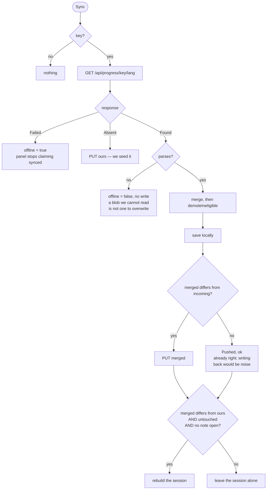
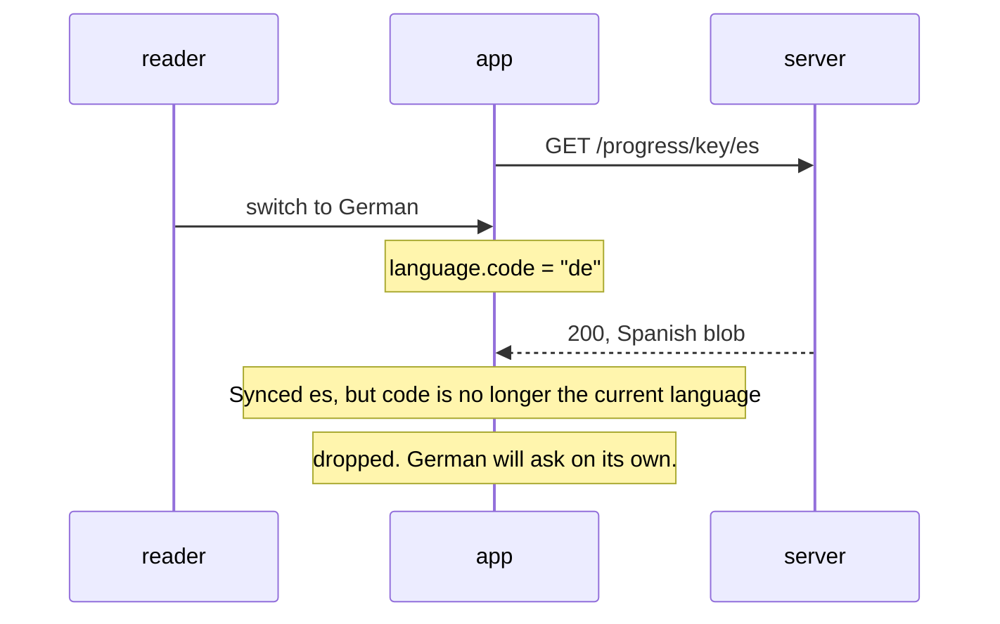
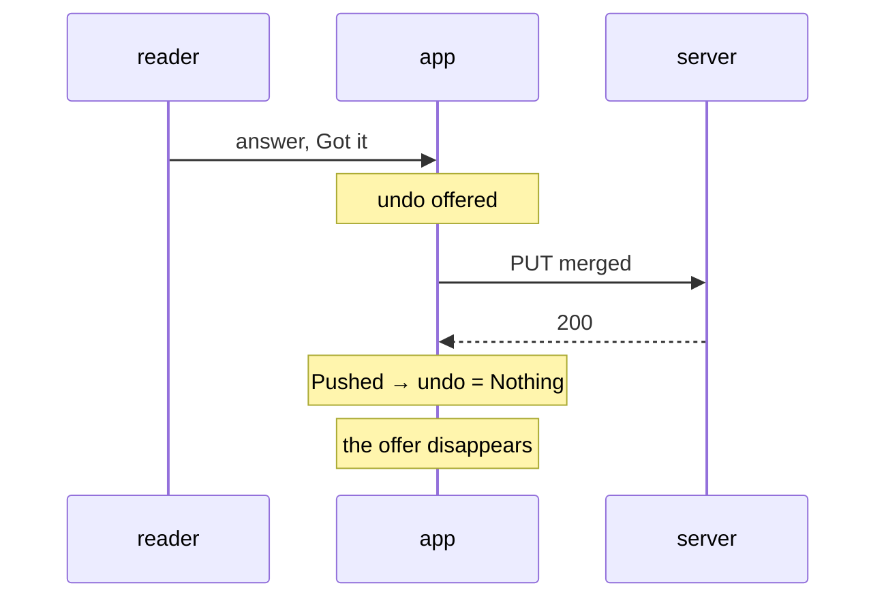
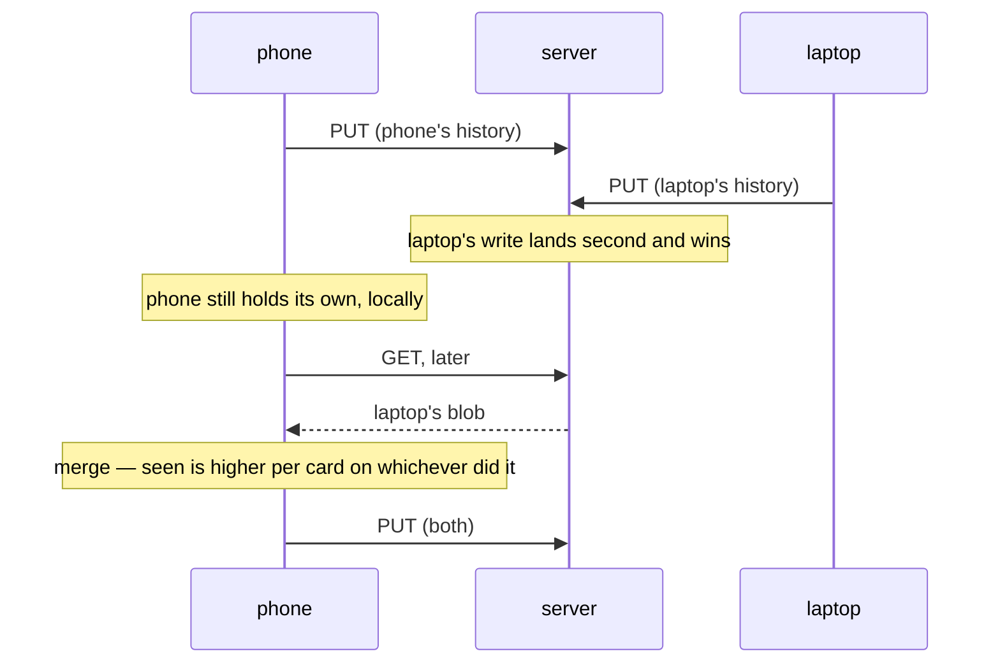
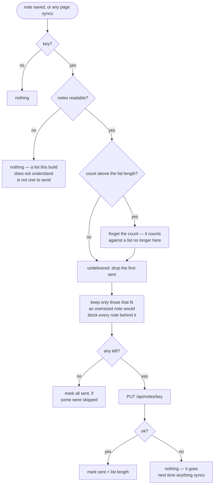

# The sync flow

The README says what sync is and why. This says what it *does*, because the
happy path is three steps and almost everything worth knowing is a timing case
that prose describes badly.

Written for the next person to change this path — which, on the evidence, is
somebody who will otherwise guess. Both diagrams are generated by GitHub from
the source below them, so they cannot drift into being pretty and wrong.

## Three kinds of blob, three different rules

Not one mechanism with three users. Three mechanisms, and confusing them is the
mistake this page exists to prevent.

| | key | direction | arbitrated by |
| --- | --- | --- | --- |
| card progress | `<key>/<lang>` | read, merge, write | `Progress.merge`, on `seen` |
| drill progress | `<key>/verbs` | read, merge, write | the same, same codec |
| notes | `<key>/<at>.json` | **write only** | nothing — the key is unique, so there is nothing to resolve |

Notes are not sync. There is no `GET`, a device never reads its notes back, and
the server has no merge rule because two devices can never write the same key.
Reaching for a sync intuition here is how an empty `notes` store gets read as a
delivery failure rather than as a reader having done its job.

## The exchange

`Sync` is dispatched on load and at the end of a session, and by **Sync now**
in the panel. Everything below is one language's blob; a switch starts again.



Two things in there are easy to get backwards.

**An unreadable blob is not an offline problem.** The network did its part, so
`offline` is set to `false` and nothing is written back. The panel goes on
saying *not synced*, which is exactly what is true. Reporting it as offline
would invite a retry that cannot help.

**An equal merge still counts as a sync.** It dispatches `Pushed` without a
request, so *last synced* updates. The server already holds this; that is as
much worth recording as a write would be.

## The edges

### A response outliving a language switch

The request carries the language it was made for. Switch while it is in flight
and the answer is dropped, because merging Spanish history into German progress
is not a bug you would find later — it is one you would find much later.



### The session rebuild, and its three guards

A session is built from the history as it was. If the merge brings in answers
from another device, the session may be full of cards already done — so it is
rebuilt. But a rebuild resets the flip, so it must not land under someone
mid-card.

```purescript
when (merged /= state.progress && untouched state.screen && isNothing (writing state)) $
  fork $ liftEffect $ StartedAnother <$> Now.now
```

All three are required:

- **`merged /= state.progress`** — the merge actually brought something in.
  Equal means the rebuild would shuffle the deck for nothing.
- **`untouched state.screen`** — nothing answered, no card turned over.
- **`isNothing (writing state)`** — no note being written. A note is *about*
  the card on screen, so taking that card away mid-sentence is the same fault
  as taking an answer away mid-tap.

### Undo against a push



The offer is withdrawn rather than left on screen to fail later. Once the
answer is on the server, undoing it locally would leave the two disagreeing,
and the next merge would arbitrate on `seen` — which the undone device has
*fewer* of, so it would lose and the answer would come back. Better to stop
offering than to offer something that quietly undoes itself.

### Two devices writing at once



Self-healing, with a window where the server is behind. Nothing is lost because
the loser never deleted anything: it still holds its own history, and the merge
is per card on `seen`, so the next exchange puts back whatever the overwrite
dropped. This is why the merge rule must stay order-insensitive — it is the
only reason a lost race is survivable.

### What travels and what does not

One key, per device. One progress blob per language under it.

| travels | stays on the device |
| --- | --- |
| card progress, per language | chosen accent and voice |
| drill progress | last-synced time |
| notes (one way, see below) | the pairing key itself |

Accent and voice are stored per language *and* per device, and never sync —
the phone's voice list is not the laptop's, so copying a choice across would
name a voice that may not exist.

### Notes: delivery, not sync

The sixth case, and the one that is not the others.



Three things here have no equivalent on the progress side:

- **A count, not a flag per note.** `flashcards.notes.sent.v1` is how many of
  this device's notes have gone. It only rises, which is why it is forgotten
  when it exceeds the list — otherwise clearing notes would strand it above the
  length for ever and nothing would send again.
- **The count is of the list that was *read*,** not of whatever is stored when
  the answer comes back. A note written mid-request was not in it, and counting
  it would mean it never goes.
- **Oversized notes are skipped, not sent and not blocking.** The sheet refuses
  to save one now, but one saved before that rule existed would otherwise hold
  up every note behind it permanently. It stays on the device and Copy all
  still has it.

Fire-and-forget, like the rest: a note that does not go now goes the next time
anything syncs, and nothing on screen waits.

## Reading an empty `notes` store

It means one of two things, and they are not distinguishable from the store:

1. nothing was ever written, or
2. everything written was delivered and then cleared with
   `npm run notes -- --filed <key> --issue <n>`

The second is the normal end state. `--filed` fails outright on a key the store
does not have, so a successful clear is itself proof the note was there — which
makes "the store is empty" evidence that delivery *worked*, not that it failed.
